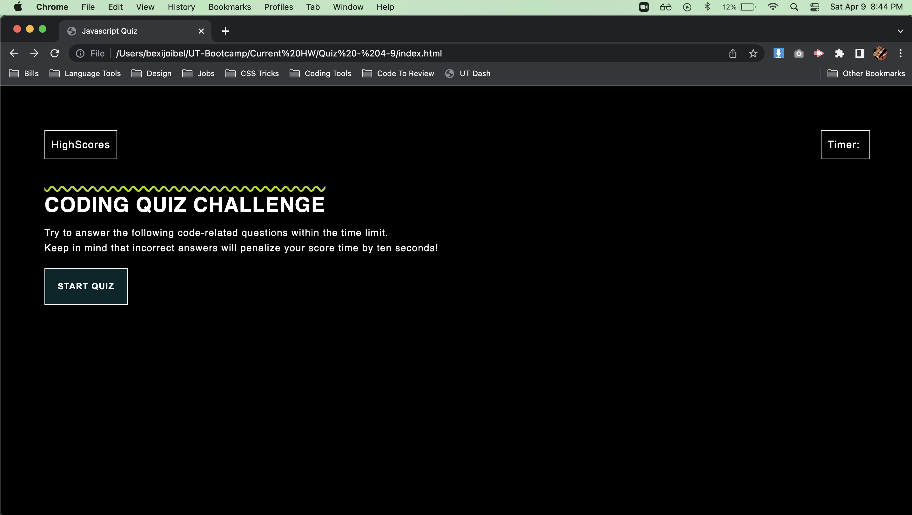

# 04 Javascript Code Quiz

## User Experience

I created an quiz application. In this app, the user can navigate through the quiz and log their answers at the end of the quiz. Once the quiz starts the timer begin simultaneously. Throughout the quiz the user will get to answer each question and receive a response from the quiz itself (wrong or correct). 

This app was very challenging to tie in the functionality along with the design. 

I've built the most of all the functionalities for the quiz to run successfully. 

## Future Development

Scoring Component - This functionality is still being produced. 

## Mock-Up

The following animation demonstrates the application functionality:

## 

